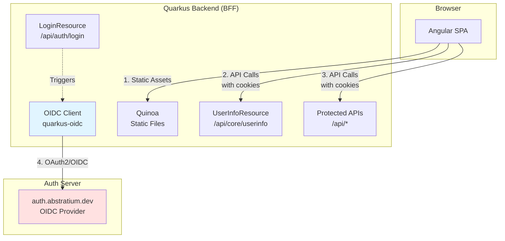
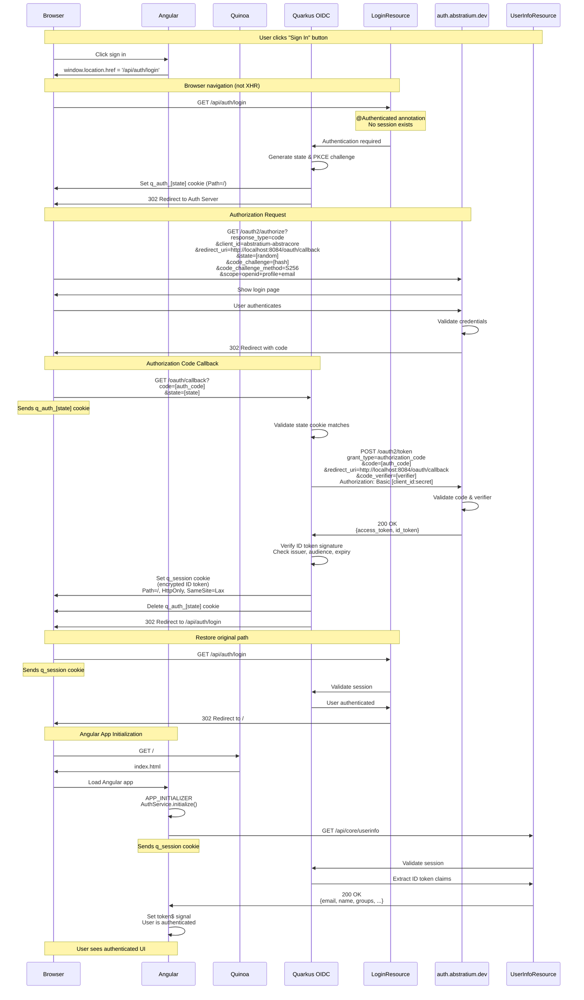
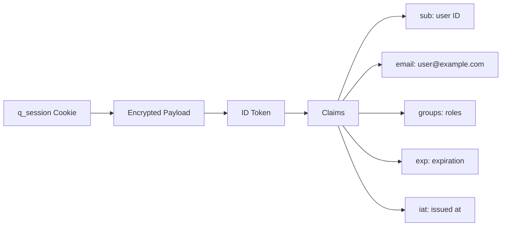
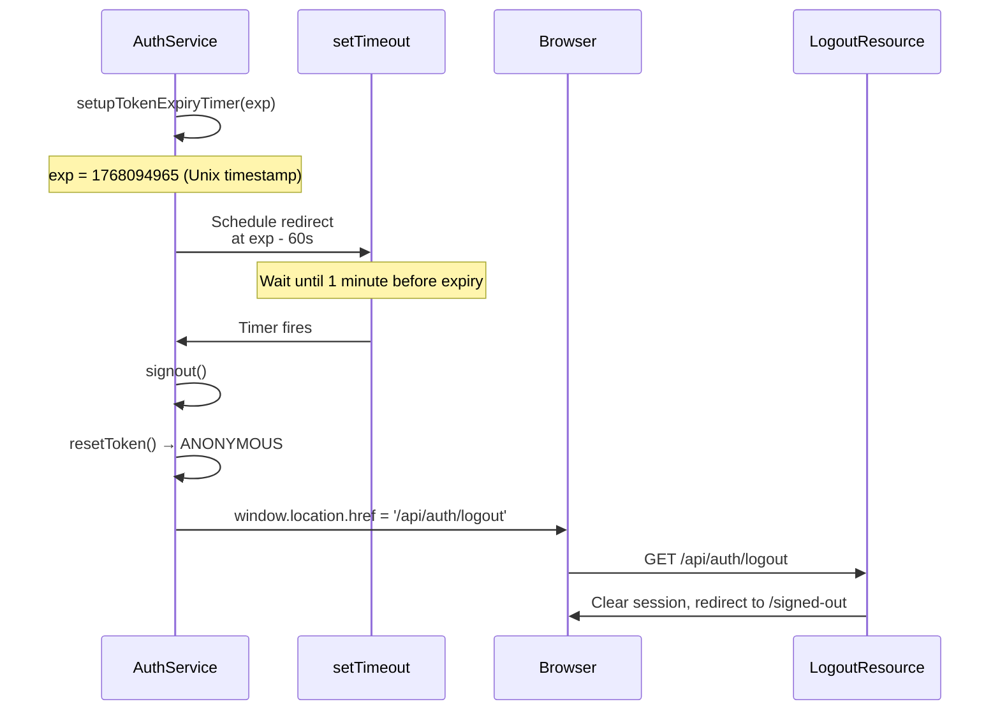
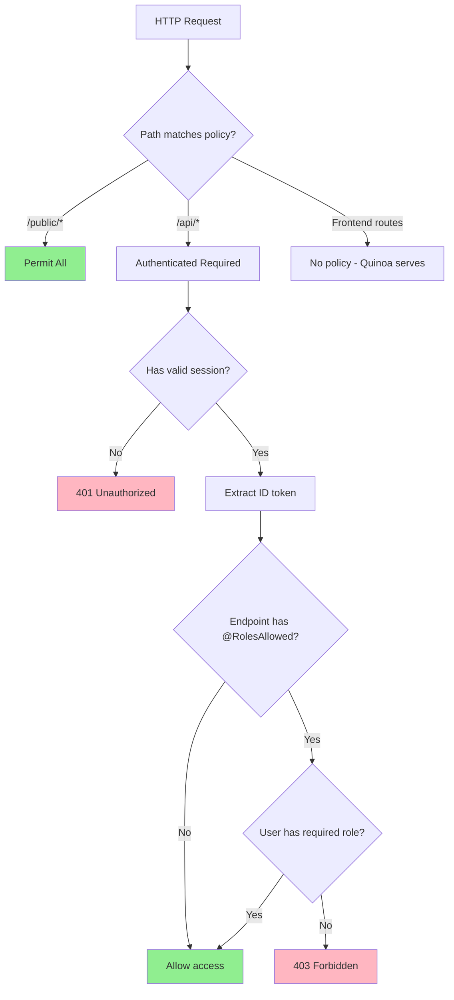
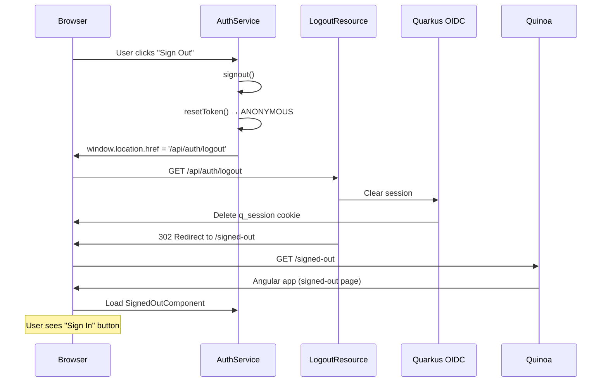

# Authentication Flow

This document describes how authentication works in the application using the **Backend For Frontend (BFF)** pattern with Quarkus OIDC and Angular.

## Table of Contents

- [Overview](#overview)
- [Architecture Pattern: BFF](#architecture-pattern-bff)
- [Key Components](#key-components)
- [Sign-In Flow](#sign-in-flow)
- [Session Management](#session-management)
- [Authorization](#authorization)
- [Sign-Out Flow](#sign-out-flow)
- [Security Features](#security-features)
- [Configuration](#configuration)

## Overview

The application uses **OpenID Connect (OIDC)** with the **Authorization Code Flow + PKCE** for secure authentication. The backend (Quarkus) acts as the OIDC client, managing tokens in HTTP-only cookies, while the frontend (Angular) remains token-agnostic.

**Key Principles:**
- JWT tokens are **never exposed** to JavaScript (stored in HTTP-only cookies)
- Angular SPA receives only the JWT payload (claims) without the signature
- All authentication logic is handled server-side by Quarkus OIDC
- PKCE (Proof Key for Code Exchange) protects against authorization code interception

## Architecture Pattern: BFF



**Why BFF?**
- **Security**: Tokens never exposed to browser JavaScript (XSS protection)
- **Simplicity**: Frontend doesn't need to handle OAuth flows or token refresh
- **Control**: Backend validates all tokens and manages session lifecycle

## Key Components

### Backend Components

| Component | Path | Purpose |
|-----------|------|---------|
| **LoginResource** | `/api/auth/login` | Triggers OIDC authentication flow |
| **UserInfoResource** | `/api/core/userinfo` | Returns JWT claims to frontend |
| **Quarkus OIDC** | `/oauth/callback` | Handles OAuth callback and token exchange |
| **Session Cookies** | `q_session` | Stores encrypted ID token (HTTP-only) |
| **State Cookies** | `q_auth_*` | CSRF protection for OAuth flow |

### Frontend Components

| Component | Purpose |
|-----------|---------|
| **AuthService** | Manages authentication state in Angular |
| **AuthGuard** | Protects routes requiring authentication |
| **SignedOutComponent** | Initiates sign-in flow |

## Sign-In Flow

### Complete Authentication Sequence



### Flow Steps Explained

#### 1. **User Initiates Sign-In**
```typescript
// SignedOutComponent.signIn()
window.location.href = '/api/auth/login';
```
- Uses browser navigation (not XHR) so Quarkus OIDC can redirect
- Triggers full page load to `/api/auth/login`

#### 2. **Quarkus OIDC Intercepts Request**
- `LoginResource` has `@Authenticated` annotation
- No session exists → OIDC authentication mechanism activates
- Generates:
  - **State parameter**: Random UUID for CSRF protection
  - **PKCE code verifier**: Random string (43-128 chars)
  - **PKCE code challenge**: SHA-256 hash of verifier, base64-encoded

#### 3. **Redirect to Authorization Server**
```
https://auth.abstratium.dev/oauth2/authorize?
  response_type=code
  &client_id=abstratium-abstracore
  &redirect_uri=http://localhost:8084/oauth/callback
  &state=9011d874-320f-4c83-8c64-cad203ec13ec
  &code_challenge=yWua0iJq5xA54UyURCz4S9W9XFxIw9VfanSv8t9rGR8
  &code_challenge_method=S256
  &scope=openid+profile+email
```
- Sets `q_auth_[state]` cookie with state, PKCE verifier, original path
- Cookie has `Path=/` so it's accessible at `/oauth/callback`

#### 4. **User Authenticates at Auth Server**
- User enters credentials or uses social login (e.g., Google)
- Auth server validates and generates authorization code
- Redirects back with code: `/oauth/callback?code=...&state=...`

#### 5. **Token Exchange**
- Quarkus OIDC validates state parameter matches cookie
- Exchanges authorization code for tokens using PKCE verifier
- Uses HTTP Basic Auth with client credentials
- Receives `id_token` and `access_token`

#### 6. **Token Verification**
- Verifies ID token signature using JWKS from auth server
- Validates:
  - **Issuer**: `https://abstrauth.abstratium.dev`
  - **Audience**: `abstratium-abstracore`
  - **Expiration**: Token not expired
  - **Not Before**: Token is valid now

#### 7. **Session Creation**
- Encrypts ID token and stores in `q_session` cookie
- Cookie settings:
  - `HttpOnly`: JavaScript cannot access
  - `SameSite=Lax`: Sent on same-site navigations
  - `Path=/`: Available for all paths
  - `Max-Age=900`: 15 minutes
- Redirects to original path (`/api/auth/login`)

#### 8. **Final Redirect to Frontend**
- `LoginResource.login()` executes successfully
- Returns `302 See Other` to `/` (frontend home)

#### 9. **Angular Initialization**
```typescript
// AuthService.initialize() - called by APP_INITIALIZER
this.http.get<Token>('/api/core/userinfo').pipe(
  tap(token => {
    this.token = token;
    this.token$.set(token);
    this.setupTokenExpiryTimer(token.exp);
  })
)
```
- Fetches user info from `/api/core/userinfo`
- Session cookie is automatically sent by browser
- Receives JWT claims (without signature)
- Sets up expiry timer

## Session Management

### Session Cookie Structure



### Cookie Configuration

| Property | Value | Purpose |
|----------|-------|---------|
| **Name** | `q_session` | Session identifier |
| **Strategy** | `id-refresh-tokens` | Stores ID token (and refresh if available) |
| **Split Tokens** | `true` | Splits large tokens across multiple cookies |
| **Encryption** | `AES-256-GCM` | Encrypts token in cookie |
| **HttpOnly** | `true` | Prevents JavaScript access (XSS protection) |
| **SameSite** | `Lax` | Allows same-site navigation, blocks cross-site |
| **Path** | `/` | Available for all paths |
| **Max-Age** | `900s` (15 min) | Session timeout |

### Token Expiry Handling



**Key Points:**
- Timer set to redirect 1 minute before token expiry
- Ensures smooth UX (user sees sign-out page, not error)
- Session cookie has same expiry as ID token

## Authorization

### Role-Based Access Control



### HTTP Auth Permissions

Configured in `application.properties`:

```properties
# Public paths - no authentication required
quarkus.http.auth.permission.public.paths=/public/*
quarkus.http.auth.permission.public.policy=permit

# Protected API paths - authentication required
quarkus.http.auth.permission.api.paths=/api/*
quarkus.http.auth.permission.api.policy=authenticated
```

**Important:** `/oauth/callback` is **NOT** in public paths. It's handled internally by Quarkus OIDC.

### Method-Level Authorization

```java
@Path("/api/demo")
public class DemoResource {
    
    @GET
    @RolesAllowed({Roles.USER})  // Requires "abstratium-abstracore_user" role
    public List<Demo> getAll() {
        return demoService.findAll();
    }
}
```

**Role Mapping:**
- JWT contains: `"groups": ["abstratium-abstracore_user"]`
- Mapped to roles via: `smallrye.jwt.path.groups=groups`
- `@RolesAllowed` checks if user has required group

### Frontend Route Guards

```typescript
// app.routes.ts
{
  path: '',
  component: HomeComponent,
  canActivate: [authGuard]  // Requires authentication
}
```

```typescript
// auth.guard.ts
export const authGuard: CanActivateFn = (route, state) => {
  const authService = inject(AuthService);
  const router = inject(Router);
  
  if (authService.isAuthenticated()) {
    return true;  // Allow access
  }
  
  router.navigate(['/signed-out']);  // Redirect to sign-in
  return false;
};
```

## Sign-Out Flow



**Key Points:**
- Frontend clears local state (sets `ANONYMOUS` token)
- Backend clears session cookie
- No RP-Initiated Logout to auth server (tokens expire naturally)
- User redirected to `/signed-out` page

## Security Features

### 1. **PKCE (Proof Key for Code Exchange)**

Protects against authorization code interception attacks.

```
Code Verifier (random): 0SybfDOhmUQEsU4Po6P1ATOuF9JApFuy7_K5UOanTWc
Code Challenge (SHA-256): yWua0iJq5xA54UyURCz4S9W9XFxIw9VfanSv8t9rGR8

Authorization Request: Sends code_challenge
Token Exchange: Sends code_verifier
Auth Server: Verifies SHA-256(code_verifier) == code_challenge
```

### 2. **State Parameter (CSRF Protection)**

Prevents cross-site request forgery in OAuth flow.

```
1. Generate random state: 9011d874-320f-4c83-8c64-cad203ec13ec
2. Store in q_auth_[state] cookie
3. Send in authorization request
4. Validate state in callback matches cookie
```

### 3. **HTTP-Only Cookies**

Tokens never exposed to JavaScript (XSS protection).

```
Set-Cookie: q_session=...; HttpOnly; SameSite=Lax; Path=/
```

### 4. **Encrypted Session Cookies**

ID tokens encrypted before storing in cookies.

```properties
quarkus.oidc.token-state-manager.encryption-required=true
quarkus.oidc.token-state-manager.encryption-secret=${COOKIE_ENCRYPTION_SECRET}
```

### 5. **SameSite Cookie Attribute**

Prevents CSRF attacks by restricting when cookies are sent.

```
SameSite=Lax: Cookies sent on same-site navigations (GET), blocked on cross-site POST
```

### 6. **Token Signature Verification**

ID tokens verified using JWKS from auth server.

```java
// Quarkus OIDC automatically:
1. Fetches JWKS from https://auth.abstratium.dev/.well-known/jwks.json
2. Verifies token signature using public key
3. Validates issuer, audience, expiration
```

### 7. **CORS Configuration**

Restricts which origins can make API requests.

```properties
quarkus.http.cors.enabled=true
quarkus.http.cors.origins=http://localhost:4204,http://localhost:8084
quarkus.http.cors.access-control-allow-credentials=true
```

## Configuration

### Quarkus OIDC Configuration

Key properties in `application.properties`:

```properties
# OIDC Provider
quarkus.oidc.auth-server-url=https://auth.abstratium.dev
quarkus.oidc.token.issuer=https://abstrauth.abstratium.dev

# Client Credentials
quarkus.oidc.client-id=abstratium-abstracore
quarkus.oidc.credentials.secret=${ABSTRATIUM_CLIENT_SECRET}

# Application Type
quarkus.oidc.application-type=web-app  # Authorization Code Flow

# PKCE
quarkus.oidc.authentication.pkce-required=true

# Scopes
quarkus.oidc.authentication.scopes=profile,email

# Callback
quarkus.oidc.authentication.redirect-path=/oauth/callback
quarkus.oidc.authentication.restore-path-after-redirect=true

# Session
quarkus.oidc.authentication.session-age-extension=PT900S  # 15 minutes
quarkus.oidc.authentication.cookie-path=/
quarkus.oidc.authentication.cookie-same-site=lax

# Token Storage
quarkus.oidc.token-state-manager.strategy=id-refresh-tokens
quarkus.oidc.token-state-manager.encryption-required=true
```

### Why These Settings Matter

| Setting | Value | Reason |
|---------|-------|--------|
| `application-type=web-app` | Authorization Code Flow | Secure flow for web apps with backend |
| `pkce-required=true` | PKCE enabled | Protects against code interception |
| `cookie-path=/` | Root path | Cookies available for `/api` and `/oauth` |
| `cookie-same-site=lax` | Lax mode | Allows redirects, blocks cross-site POST |
| `restore-path-after-redirect=true` | Restore original path | User returns to intended page after login |

### Common Issues and Solutions

#### Issue: 404 at `/oauth/callback`

**Cause:** `/oauth/*` was in public paths, bypassing OIDC processing.

**Solution:** Remove `/oauth/*` from `quarkus.http.auth.permission.public.paths`.

#### Issue: Session cookie not sent after callback

**Cause:** `SameSite=Strict` blocks cookies on redirects.

**Solution:** Use `SameSite=Lax` to allow same-site navigations.

#### Issue: State cookie not accessible at callback

**Cause:** Cookie path was `/api`, but callback is at `/oauth/callback`.

**Solution:** Set `cookie-path=/` so cookies available for all paths.

#### Issue: 403 Forbidden on API calls

**Cause:** Role mismatch - JWT has `abstratium-abstrasst_user` but code checks for `abstratium-abstrasst_other`.

**Solution:** Update `Roles.CLIENT_ID` to match actual OIDC client ID.

#### Issue: Issuer validation fails

**Cause:** Auth server issues tokens with different issuer than auth-server-url.

**Solution:** Set `quarkus.oidc.token.issuer` to actual issuer in tokens.

## Summary

This authentication implementation provides:

✅ **Security**: Tokens in HTTP-only cookies, PKCE, state validation  
✅ **Simplicity**: Frontend is token-agnostic, backend handles OAuth  
✅ **Standards**: OpenID Connect with Authorization Code Flow  
✅ **User Experience**: Seamless sign-in/sign-out, session expiry handling  
✅ **Authorization**: Role-based access control with JWT groups  

The BFF pattern ensures that sensitive tokens never reach the browser's JavaScript environment, providing defense-in-depth against XSS attacks while maintaining a clean separation between frontend and backend concerns.
